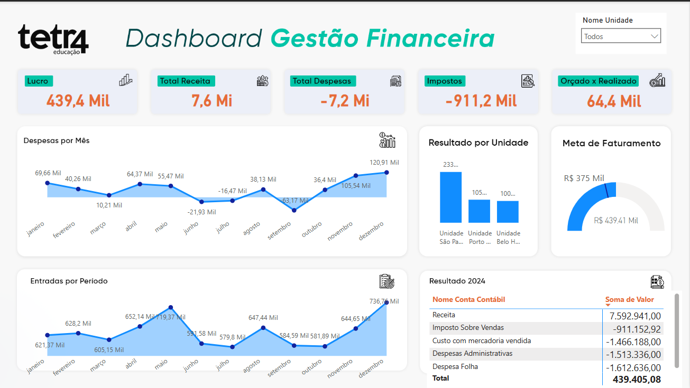

  

# Dashboard Financeiro - Varejo

Este projeto apresenta um painel desenvolvido no Power BI simulando uma empresa do setor varejista. O objetivo é visualizar indicadores financeiros de forma clara e interativa, facilitando a tomada de decisões estratégicas.

## 📊 Indicadores e elementos incluídos

- Faturamento total
- Despesas com Mercadorias Vendidas (DMV)
- Lucro bruto
- Margem de lucro
- Comparativo de metas vs. realizado
- Visão por período e total acumulado

## 🛠️ Ferramentas utilizadas

- Power BI Desktop
- Medidas DAX (como Realizado, Orçado, Orçado x Realizado)
- Modelagem de dados simples
- Estilo visual limpo e direto

## 🎥 Vídeo demonstrativo

- [Assista no YouTube](https://youtu.be/t6LiWKv2Kqw)

## 🗂️ Arquivo PBIX

Incluído neste diretório: `Dashboard 1 - Empresa ABCD - Movimentação Financeira.pbix`

---

## 📷 Visualização do Dashboard

---

📌 *Este projeto faz parte do repositório geral [Projetos Power BI](https://github.com/Rodrigo-RRC/Projetos_PowerBi) de Rodrigo Ribeiro Carvalho.*

